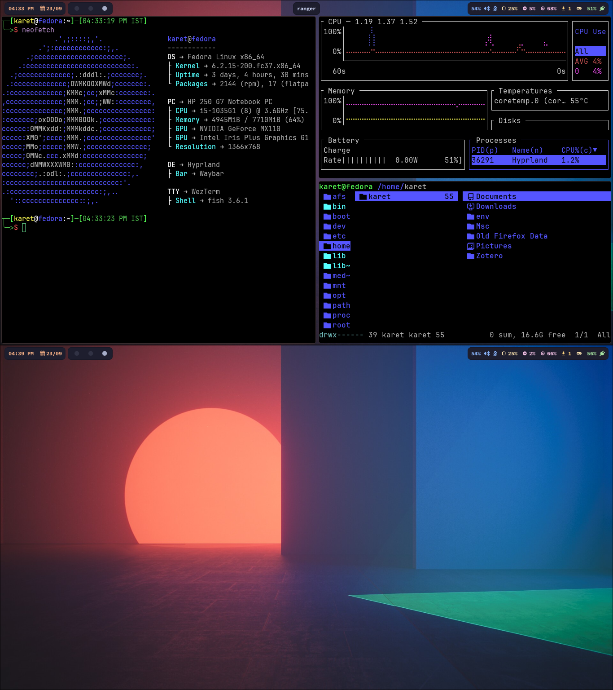

- Window manager: Hyprland
- Status bar: Waybar
- Launcher: fuzzel
- Terminal: Wezterm
- Shell: fish
- File manager: Ranger; Thunar
- Terminal task manager: bottom
- Editor: Neovim; VSCodium

# Setup

Credits: 
[linuxmobile/hyprland-dots](https://github.com/linuxmobile/hyprland-dots)
