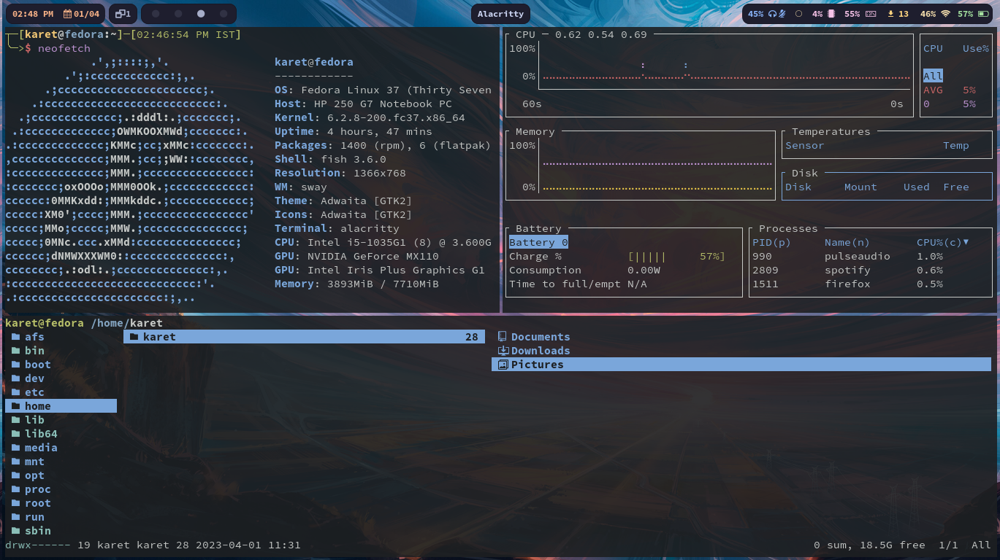

# Fedora 37 Server Minimal install 
- Window manager: sway
- Status bar: Waybar
- Launcher: wofi
- Terminal: Alacritty
- Shell: fish
- File manager: Ranger; Thunar
- Terminal task manager: bottom

# Setup

Waybar config C: [linuxmobile/hyprland-dots](https://github.com/linuxmobile/hyprland-dots)
